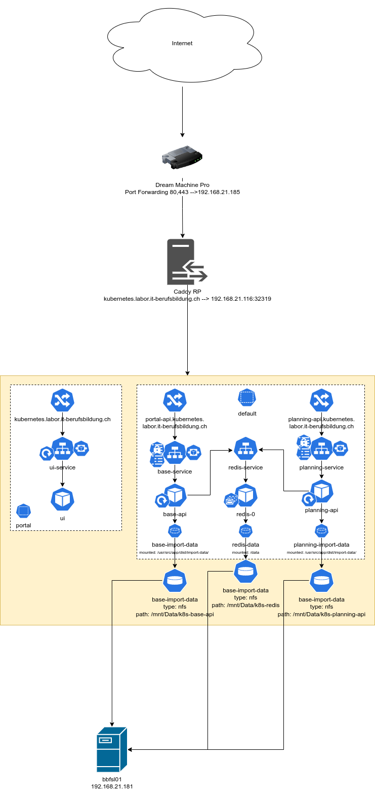
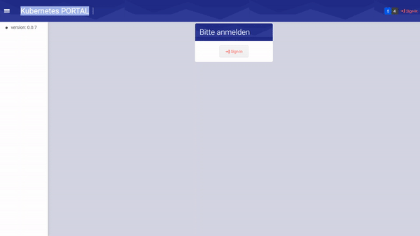

# Portal mit Kubernetes

In diesem Projekt habe ich mir vorgenommen, das [Portal](https://gitlab.com/it-berufsbildung-projekte/itag-berufsbildung) der IT-Berufsbildung mit Kubernetes in Betrieb zu nehmen.
Dies schien für mich die perfekte Aufgabe zu sein, da das Portal aus einer simplen Webapplikation ohne Umgebungsvariablen, mehreren APIs, die mit vielen Umgebungsvariablen beinhalten und einer Stateful Datenbank besteht.
Das Portal wollte ich nicht mit allen APIs hochfahren, da diese den Rahmen des Projektes gesprengt hätte. Daher habe ich mir konkret folgendes vorgenommen:

- User Interface Deployen
- Base API Deployen
	- ConfigMaps
  - Secrets
- Planning API Deployen
	- ConfigMaps
  - Secrets
- Redis Datenbank Deployen
	- StatefulSet



> UI und APIs, sowie die Datenbank sind nicht im selben Namespace, da ich ausprobieren wollte, wie sich Kubernetes verhält, wenn die Ressourcen in verschiedenen Namespaces sind.


## User Interface
Für das UI war in diesem Projekt sicherlich der einfachste Teil. 
Um überhaupt auf das Image in unserer privaten Registry zugreifen zu können, musste ich ein Image Pull Secret definieren. Dies habe ich nach offizieller [Kubernetes Dokumentation](https://kubernetes.io/docs/tasks/configure-pod-container/pull-image-private-registry/) gemacht.
Anschliessend konnte ich mein Deployment Script schreiben.

### Deployment
```yml
apiVersion: apps/v1
kind: Deployment
metadata:
  name: portal-ui
  namespace: portal
spec:
  selector:
    matchLabels:
      app: portal-ui
  template:
    metadata:
      labels:
        app: portal-ui
    spec:
      containers:
      - name: portal-ui
        image: registry.gitlab.com/it-berufsbildung-projekte/docker-images/kubernetes/portal-ui:latest
        resources:
          limits:
            memory: "512Mi"
            cpu: "500m"
          # Jeder Request bekommt 200 Mili-Cores
          requests:
            cpu: 200m
        ports:
        - containerPort: 80
      # Secret für die private Registry
      imagePullSecrets:
      - name: regcred
---

apiVersion: v1
kind: Service
metadata:
  name: portal-ui
spec:
  selector:
    app: portal-ui
  ports:
  - port: 80
    targetPort: 80
```  

### Ingress
Um auf das Portal auch extern zugreifen zu können, habe ich eine Ingress Regel definiert. Man hätte theoretisch den Service auch mittels NodePort freigeben können, der Ingress ist jedoch die deutlich schönere Lösung. Alle HTTP Anfragen landen zuerst bei unserem Reverseproxy Caddy. Dieser vergibt den Diensten ein SSL Zertifikat und leitet sie an das Cluster weiter, wo sie anhand der Ingress Regeln weitergeleitet werden. 

```yml
apiVersion: networking.k8s.io/v1
kind: Ingress
metadata:
  name: portal-ui-ingress
  namespace: portal
  annotations:
    kubernetes.io/ingress.class: nginx
spec:
  rules:
  - host: kubernetes.labor.it-berufsbildung.ch
    http:
      paths:
      - pathType: Prefix
        path: "/"
        backend:
          service:
            name: portal-ui
            port: 
              number: 80
```  

### HPA
Mit der [horizontalen Pod Autoskalierung](https://kubernetes.io/docs/tasks/run-application/horizontal-pod-autoscale-walkthrough/) konnte ich eine Regel definieren, bei der automatisch je nach Auslastung mehr Pods hochgefahren werden, oder auch überflüssige gelöscht werden. Hierfür musste ich ebenfalls nochmals ein Configfile schreiben.

```yml
apiVersion: autoscaling/v2
kind: HorizontalPodAutoscaler
metadata:
  name: portal-ui
  namespace: portal
spec:
  scaleTargetRef:
    apiVersion: apps/v1
    kind: Deployment
    name: portal-ui 
  minReplicas: 2
  maxReplicas: 10
  metrics:
  - type: Resource
    resource:
      name: cpu
      target:
        type: Utilization
        averageUtilization: 50
```
Mit dieser Konfiguration wird das Deployment `portal-ui` automatisch hochskaliert, nachdem ein Pod mehr als 50 % ausgelastet ist. Hierbei müssen immer mindestens 2 Instanzen laufen und es können maximal 10 Instanzen hochgefahren werden. 

Somit hatte ich nun also das UI deployt und konnte mich an das Umsetzen der Datenbank kümmern.

## Redis Datenbank

Um die Redis Datenbank zu deployen, musste ich ein StatefulSet verwenden. Dieses wird immer dann gebraucht, wenn eine Stateful Applikation deployt wird. 

### StatefulSet

```yml
apiVersion: apps/v1
kind: StatefulSet
metadata:
  name: redis
spec:
  selector:
    matchLabels:
      app: redis
  serviceName: redis
  template:
    metadata:
      labels:
        app: redis
    spec:
      containers:
      - name: redis
        image: dockermike1809/itbb-redis
        ports:
        - containerPort: 6379
        volumeMounts:
          - mountPath: /data
            name: redis-data
        resources:
          limits:
            memory: "512Mi"
            cpu: "500m"
      volumes:
      - name: redis-data
        nfs:
          server: 192.168.21.181
          path: /mnt/Data/k8s-redis
---
apiVersion: v1
kind: Service
metadata:
  name: redis
spec:
  selector:
    app: redis
  ports:
  - port: 6379
```
Hier musste ich nun mein erstes Volume verwenden. Dafür habe ich auf unserem NAS einen NFS Share erstellt, der anschliessend direkt an den Pods angehängt wird. Somit sind meine Daten sicher ausserhalb des Clusters aufbewahrt.

### Replikation
Da das Replizieren einer Datenbank immer eine grosse Herausforderung ist, hatte ich auch hier deutlich Mühe. Ich habe versucht, das Ganze anhand einer [Anleitung](https://www.containiq.com/post/deploy-redis-cluster-on-kubernetes), die ich im Internet gefunden habe, umzusetzen. 
Die Datenbanken sind zwar alle hochgekommen, sie schienen auch synchronisiert zu sein, jedoch nachdem ich versucht hatte etwas auf die Datenbanken zu schreiben, gab es Konflikte und jede Datenbank war auf einem anderen Stand.
Daher habe ich mich dazu entschieden, die Skalierung der Datenbank wegzulassen und mit "nur" einer Instanz der Datenbank weiterzumachen.

Nachdem meine Datenbank erfolgreich deployt wurde, konnte ich mich mit dem Deploy der ersten API auseinandersetzen.

## Base API
Die Base API kam mit vielen Umgebungsvariablen daher. Da ich diese in einer ConfigMap und in einem Secret definiert habe, wurde das Deployment Script relativ lange.


### ConfigMap
```yml
apiVersion: v1
kind: ConfigMap
metadata:
  name: base-api-configmap
data:
	# URL, auf der die Base-API zu finden ist
  BASE_API_URL: https://portal-api.kubernetes.labor.it-berufsbildung.ch
  # URL des Redis Services. Somit weiss die API, wo die Datenbank liegt.
  REDIS_URL: redis.default.svc.cluster.local 
  REDIS_PORT: "6379"
  REDIS_DATABASE: "1"
  REDIS_PASSWORD: 1234
  CORS_ORIGIN: "*"
  LOG_LEVELS: '["verbose","debug","log","warn","error"]'
  API_PROTOCOL: http
  # Anders als bei Docker, ist der Container bzw. der Podname nicht fix.
  # Daher musste ich 0.0.0.0 nehmen, damit die API auf jedem Interface hört.
  API_HOST: 0.0.0.0 
  API_PORT: "3331"
  ENVIRONMENT: dev
  AUTH_ISSUER: https://it-berufsbildung.eu.auth0.com
  AUTH_AUD: portal@it-berufsbildung.ch
  SERVER_PROTOCOL: https
  SERVER_HOST: portal-api.kubernetes.labor.it-berufsbildung.ch
  SERVER_PORT: "443"
```
Somit hatte ich die nicht "schützenswerten Variablen" definiert. Da ich aber auch noch die Client-Informationen für Auth0 irgendwo unterbringen musste, musste noch ein Secret erstellt werden. 

### Secret
```yml
apiVersion: v1
kind: Secret
metadata:
  name: base-secret
type: Opaque
data:
  AUTH_CLIENT_ID: base64-kodierte-werte
  AUTH_CLIENT_SECRET: base64-kodierte-werte
```
Mit dem Secret hatte ich jetzt alle Umgebungsvariablen gesetzt und es war an der Zeit, das Deployment zu schreiben :tada:.

### Deployment
```yml
apiVersion: apps/v1
kind: Deployment
metadata:
  name: base-api
spec:
  selector:
    matchLabels:
      app: base-api
  template:
    metadata:
      labels:
        app: base-api
    spec:
      containers:
      - name: base-api
        image: registry.gitlab.com/it-berufsbildung-projekte/docker-images/int/portal-api:latest
        resources:
          limits:
            memory: "512Mi"
            cpu: "500m"
          requests:
            cpu: 200m
        volumeMounts:
          - mountPath: /usr/src/app/dist/import-data/
            name: base-api-volume
        ports:
        - containerPort: 3331
        env:
          - name: AUTH_ISSUER
            valueFrom:
              configMapKeyRef:
                name: base-api-configmap
                key: AUTH_ISSUER
          - name: BASE_API_URL
            valueFrom:
              configMapKeyRef:
                name: base-api-configmap
                key: BASE_API_URL
          - name: REDIS_URL
            valueFrom:
              configMapKeyRef:
                name: base-api-configmap
                key: REDIS_URL
          - name: REDIS_PORT
            valueFrom:
              configMapKeyRef:
                name: base-api-configmap
                key: REDIS_PORT
          - name: REDIS_DATABASE
            valueFrom:
              configMapKeyRef:
                name: base-api-configmap
                key: REDIS_DATABASE
          - name: CORS_ORIGIN
            valueFrom:
              configMapKeyRef:
                name: base-api-configmap
                key: CORS_ORIGIN
          - name: LOG_LEVELS
            valueFrom:
              configMapKeyRef:
                name: base-api-configmap
                key: LOG_LEVELS
          - name: API_PROTOCOL
            valueFrom:
              configMapKeyRef:
                name: base-api-configmap
                key: API_PROTOCOL
          - name: API_HOST
            valueFrom:
              configMapKeyRef:
                name: base-api-configmap
                key: API_HOST
          - name: API_PORT
            valueFrom:
              configMapKeyRef:
                name: base-api-configmap
                key: API_PORT
          - name: ENVIRONMENT
            valueFrom:
              configMapKeyRef:
                name: base-api-configmap
                key: ENVIRONMENT
          - name: AUTH_AUD
            valueFrom:
              configMapKeyRef:
                name: base-api-configmap
                key: AUTH_AUD
          - name: AUTH_CLIENT_ID
            valueFrom:
              secretKeyRef:
                name: base-secret
                key: AUTH_CLIENT_ID
          - name: AUTH_CLIENT_SECRET
            valueFrom:
              secretKeyRef:
                name: base-secret
                key: AUTH_CLIENT_SECRET
          - name: REDIS_PASSWORD
            valueFrom:
              configMapKeyRef:
                name: base-api-configmap
                key: REDIS_PASSWORD
          - name: SERVER_PROTOCOL
            valueFrom:
              configMapKeyRef:
                name: base-api-configmap
                key: SERVER_PROTOCOL
          - name: SERVER_HOST
            valueFrom:
              configMapKeyRef:
                name: base-api-configmap
                key: SERVER_HOST
          - name: SERVER_PORT
            valueFrom:
              configMapKeyRef:
                name: base-api-configmap
                key: SERVER_PORT
      imagePullSecrets:
      - name: regcred
      volumes:
      - name: base-api-volume
        nfs:
          server: 192.168.21.181
          path: /mnt/Data/k8s-base-api

---

apiVersion: v1
kind: Service
metadata:
  name: base-api
spec:
  selector:
    app: base-api
  ports:
  - port: 3331
    targetPort: 3331
```    
Auch hier wird wieder auf unser NAS zugegriffen, damit die API an die Import-Daten kommt. 

### Ingress
Da die API von aussen erreicht sein sollte, musste wieder ein Ingress Regel geschrieben werden.  

```yml
apiVersion: networking.k8s.io/v1
kind: Ingress
metadata:
  name: base-api-ingress
  annotations:
    kubernetes.io/ingress.class: nginx
  labels:
    name: base-api-ingress
spec:
  rules:
  - host: portal-api.kubernetes.labor.it-berufsbildung.ch
    http:
      paths:
      - pathType: Prefix
        path: "/"
        backend:
          service:
            name: base-api
            port: 
              number: 3331
```
Die Regel ist vom Aufbau her gleich wie beim UI. 

Somit war nun also auch die Base API einsatzbereit :triumph:

## Planning API
Da die Planning API vom Aufbau her exakt gleich ist wie die Base-API, werde ich das Deployment hier nicht genauer ausführen.

## Fazit
Ich bin sehr erstaunt, dass ich dieses Projekt tatsächlich hingebracht habe und das auch noch in so kurzer Zeit. Stolz auf mich bin ich sicherlich und meiner Meinung nach habe ich dieses Projekt sehr viel Willensstärke bewiesen, da ich auch bei gescheiterten Versuchen nie aufgegeben habe.



### Positives
In diesem Projekt hatte ich sehr viel Spass und ich bin extrem Stolz auf mich, dass ich das Projekt in solch kurzer Zeit realisieren konnte. Ich konnte ich weniger als einer Woche mein Projekt Planen und realisieren. 

### Negatives
Ich habe ziemlich mit dem DNS-Server der Pods gekämpft. Damit die Pods sich bei Auth0 registrieren können, muss diese Domäne vom Core DNS aufgelöst werden können. Da dies bei mir aber nicht funktioniert hat, musste ich mir eine Lösung im Internet zusammensuchen. 
Schlussendlich habe ich herausgefunden, dass ich mittels einer ConfigMap den DNS-Server, mit dem der Core DNS Dienst selbst seine Anfragen auflöst, setzen kann.  

```yml
apiVersion: v1
kind: ConfigMap
metadata:
  name: coredns
  namespace: kube-system
data:
  Corefile: |
    .:53 {
        errors
        health {
            lameduck 5s
        }
        ready
        kubernetes cluster.local in-addr.arpa ip6.arpa {
            pods insecure
            fallthrough in-addr.arpa ip6.arpa
            ttl 30
        }
        prometheus :9153
        # Hier kann der DNS Server gesetzt werden
        forward . 8.8.8.8
        cache 30
        loop
        reload
        loadbalance
    }
```    
Nachdem man diese ConfigMap erstellt wurde, muss der Core DNS Dienst neu gestartet werden. Da man in Kubernetes keine Pods in dem Sinn neu starten kann, müssen diese gelöscht werden, damit anschliessend neue Pods mit der neuen Konfiguration hochkommen. Dafür kann man folgenden Befehl verwenden:

```
 kubectl delete pods coredns-<podname pod1> coredns-<podname pod2> -n kube-system
 ```