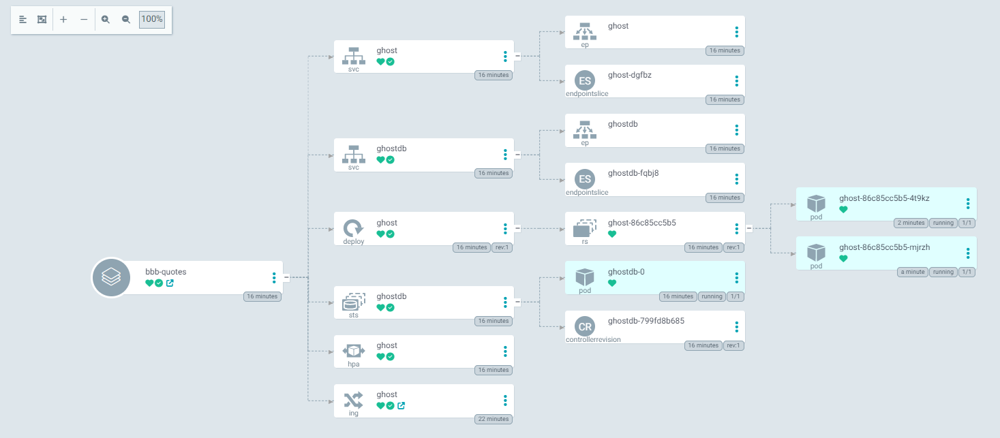

# BBB-Quotes

Eines meiner favorisierten Projekte ist zweifelsohne "BBB-Quotes". In Zusammenarbeit mit einem Mitschüler aus meiner Berufsfachschule initiierten wir dieses Vorhaben, um die herausragendsten Zitate unserer Lehrerinnen und Lehrer festzuhalten. Da unser Fachgebiet die Informatik ist, nutzten wir die Gelegenheit, um unsere Kenntnisse und Fähigkeiten weiter auszubauen.

Zum damaligen Zeitpunkt beschäftigte ich mich intensiv mit der Erlernung von Kubernetes, einer container-orchestrierungsplattform, die die Bereitstellung, Skalierung und Verwaltung von containerisierten Anwendungen erleichtert. Daher entschied ich mich, die Implementierung von "BBB-Quotes" mithilfe von Kubernetes voranzutreiben, um sowohl praktische Erfahrungen zu sammeln als auch den Betrieb unserer Anwendung effizient zu gestalten.

## Aufbau

Um die Plattform erfolgreich in Betrieb zu nehmen, entschied ich mich für die Anmietung eines Cloud-Servers bei IONOS. Nach einer gewissen Zeit entfernte ich die Docker-Services von diesem Server und installierte stattdessen MikroK8s, eine leichtgewichtige Kubernetes-Distribution, die sich ideal für den Einsatz auf solchen Cloud-Servern eignet.

Bei der Entwicklung von "BBB-Quotes" entschieden wir uns für die Verwendung des Content Management Systems (CMS) "Ghost". Ghost ist ein modernes, flexibles und benutzerfreundliches CMS, das sich besonders für das Veröffentlichen und Verwalten von Inhalten eignet. Durch die Integration von Ghost in unsere Plattform konnten wir eine ansprechende Benutzeroberfläche erstellen und eine effiziente Verwaltung der gesammelten Zitate gewährleisten.

Anschliessend erstellte ich die Deployment-YAML-Dateien für das "BBB-Quotes"-Projekt. Diese Dateien werden mithilfe von Argo CD, einem Continuous Delivery-Tool, automatisch abgerufen und auf dem Server bereitgestellt. Dadurch ist die Webseite unter der URL "https://bbb-quotes" zugänglich.

Um eine sichere Verbindung zu gewährleisten, nutze ich den Caddy Ingress Controller in Kombination mit Let's Encrypt, um SSL-Zertifikate für die Plattform zu beziehen. Dies ermöglicht es, die Kommunikation zwischen den Benutzern und der Webseite durch eine verschlüsselte Verbindung zu schützen und gleichzeitig die Vertrauenswürdigkeit der Plattform zu erhöhen.  

### Argocd

